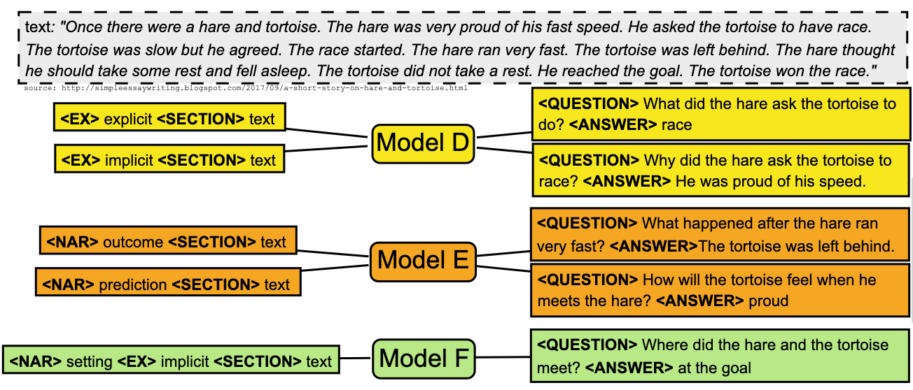

# Towards Enriched Controllability for Educational Question Generation
===============

Sample source code and models for our [AIED 2023](https://www.aied2023.org/accepted_papers.html) paper: [Towards Enriched Controllability for Educational Question Generation](https://www.aied2023.org/accepted_papers.html)

**Abstract:** Question Generation (QG) is a task within Natural Language Processing (NLP) that involves automatically generating questions given an input, typically composed of a text and a target answer. Recent work on QG aims to control the type of generated questions so that they meet educational needs. A remarkable example of controllability in educational QG is the generation of questions underlying certain narrative elements, e.g., causal relationship, outcome resolution, or prediction. This study aims to enrich controllability in QG by introducing a new guidance attribute: question explicitness. We propose to control the generation of explicit and implicit wh-questions from children-friendly stories. We show preliminary evidence of controlling QG via question explicitness alone and simultaneously with another target attribute: the question's narrative element.

**Authors:** Bernardo Leite, Henrique Lopes Cardoso

## Illustrative Example



## Main Features
* Training, inference and evaluation scripts for controllable QG
* Fine-tuned QG T5 models for controllable QG (**to be done**)

## Prerequisites
```bash
Python 3 (tested with version 3.9.13 on Windows 10)
```

## Installation and Configuration
1. Clone this project:
    ```python
    git clone https://github.com/bernardoleite/question-generation-control
    ```
2. Install the Python packages from [requirements.txt](https://github.com/bernardoleite/question-generation-control/blob/main/requirements.txt). If you are using a virtual environment for Python package management, you can install all python packages needed by using the following bash command:
    ```bash
    cd question-generation-control/
    pip install -r requirements.txt
    ```

## Usage
You can use this code for **data preparation**, **training**, **inference/predicting** and **evaluation**.

### Data preparation
Current experiments use the [FairytaleQA](https://aclanthology.org/2022.acl-long.34/) dataset. So the next steps are specifically intended to preparing this dataset.
* Example for preparing the (original) FairytaleQA dataset:
1.  Create `FairytaleQA_Dataset` folder inside `data` folder
2.  Download the files and folders from [here](https://github.com/WorkInTheDark/FairytaleQA_Dataset/tree/main/FairytaleQA_Dataset_Sentence_Split) and place them inside `data/FairytaleQA_Dataset` folder
3. Run `src/data/do_splits_processed_gen.py` (data prepared for QA and QG baselines, see paper)
4. Check if `data/splits_processed_gen/` folder has been created
5. Run `src/data/do_splits_processed_ctrl_sk_a.py` (data prepared for ***controlled train/dev/test***, see paper)
6. Check if `data/processed_ctrl_sk_a/` folder has been created

### Training: Example for question **narrative/skill** control
1.  Go to `src/model`. The file `train.py` is responsible for the training routine. Type the following command to read the description of the parameters:
    ```bash
    python train.py -h
    ```
    You can also run the example training script (linux and mac) `train_qg_t5_base_512_128_32_10_skill-text_question-answer_seed_44.sh`:
    ```bash
    bash train_qg_t5_base_512_128_32_10_skill-text_question-answer_seed_44.sh
    ```
    The previous script will start the training routine with predefined parameters:
    ```python
    #!/usr/bin/env bash

    for ((i=44; i <= 44; i++))
    do
        taskset --cpu-list 1-24 python train.py \
        --dir_model_name "qg_t5_base_512_128_32_10_skill-text_question-answer_seed_${i}" \
        --model_name "t5-base" \
        --tokenizer_name "t5-base" \
        --train_path "../../data/FairytaleQA_Dataset/processed_ctrl_sk_a/train.json" \
        --val_path "../../data/FairytaleQA_Dataset/processed_ctrl_sk_a/val.json" \
        --test_path "../../data/FairytaleQA_Dataset/processed_ctrl_sk_a/test.json" \
        --max_len_input 512 \
        --max_len_output 128 \
        --encoder_info "skill_text" \
        --decoder_info "question_answer" \
        --batch_size 32 \
        --max_epochs 10 \
        --patience 2 \
        --optimizer "AdamW" \
        --learning_rate 0.0001 \
        --epsilon 0.000001 \
        --num_gpus 1 \
        --seed_value ${i}
    done
    ```

2. In the end, predictions will be available at `predictions/checkpoint-name`. The folder contains model predictions (`predictions.json`), and parameters (`params.json`).


### Training: Example for question **explicitness/answertype** control
1.  Go to `src/model`. The file `train.py` is responsible for the training routine. Type the following command to read the description of the parameters:
    ```bash
    python train.py -h
    ```
    You can also run the example training script (linux and mac) `train_qg_t5_base_512_128_32_10_answertype-text_question-answer_seed_44.sh`:
    ```bash
    bash train_qg_t5_base_512_128_32_10_answertype-text_question-answer_seed_44.sh
    ```
    The previous script will start the training routine with predefined parameters:
    ```python
    #!/usr/bin/env bash

    for ((i=44; i <= 44; i++))
    do
        taskset --cpu-list 1-24 python train.py \
        --dir_model_name "qg_t5_base_512_128_32_10_answertype-text_question-answer_seed_${i}" \
        --model_name "t5-base" \
        --tokenizer_name "t5-base" \
        --train_path "../../data/FairytaleQA_Dataset/processed_ctrl_sk_a/train.json" \
        --val_path "../../data/FairytaleQA_Dataset/processed_ctrl_sk_a/val.json" \
        --test_path "../../data/FairytaleQA_Dataset/processed_ctrl_sk_a/test.json" \
        --max_len_input 512 \
        --max_len_output 128 \
        --encoder_info "answertype_text" \
        --decoder_info "question_answer" \
        --batch_size 32 \
        --max_epochs 10 \
        --patience 2 \
        --optimizer "AdamW" \
        --learning_rate 0.0001 \
        --epsilon 0.000001 \
        --num_gpus 1 \
        --seed_value ${i}
    done
    ```

2. In the end, predictions will be available at `predictions/checkpoint-name`. The folder contains model predictions (`predictions.json`), and parameters (`params.json`).

**Note**: You can change *encoder_info* parameter as follows:
   - skill_text: control question narrative elements
   - answertype_text: control question explicitness
   - skill_answertype_text: control question explicitness and narrative elements (same time)

### Inference: Example for question **narrative/skill**
Go to `src/model`. The script file `inference_qg_t5_base_512_128_32_10_skill-text_question-answer_seed_44.sh` is an example for the inference routine.

**Important note**: Replace **XX** and **YY** according to epoch number and loss from checkpoint_model_path and predictions_save_path parameters.

### Inference: Example for question **explicitness/answertype**
1.  Go to `src/model`. The script file `inference_qg_t5_base_512_128_32_10_answertype-text_question-answer_seed_44.sh` will generate both questions and answers
2.  You need to create a QA system for answering the generated questions. Go to `src/model` and run `train_qa.sh`
3.  Go to `src/model`. The script file `inference_qa_questiongen_t5_base_512_128_32_10_answertype-text_question-answer_seed_44.sh` is for making the QA system answer the generated questions. 

**Important note**: Replace **XX**, **YY**, **KK** and **ZZ** according to epoch number and loss from checkpoint_model_path and predictions_save_path parameters.

### Evaluation (Question Generation)
1.  For QG evaluation, you first need to install/configure [Rouge](https://github.com/google-research/google-research/tree/master/rouge) and [BLEURT](https://github.com/google-research/bleurt)
2.  Go to `src/eval-qg.py` file
3.  See **preds_path** list and choose (remove or add) additional predictions. Current predictions are the ones reported in the article
4.  Run `src/eval-qg.py` to computer evaluation scores
**Note**: Our experiments showed that BLEURT took too long to compute the scores. For these reasons, we have commented on the code's computation and output of BLEURT values. If you still want to compute BLEURT, update ***bleurt_checkpoint*** and uncomment the BLEURT lines.

### Evaluation (Question Answering)
1.  For QA evaluation, you first need to install/configure [Rouge](https://github.com/google-research/google-research/tree/master/rouge)
2.  Go to `src/eval-qa.py` file
3.  See **preds_path** list and choose (remove or add) additional predictions. Current predictions are the ones reported in the article
4.  Run `src/eval-qa.py` to computer evaluation scores

## Issues and Usage Q&A
To ask questions, report issues or request features, please use the GitHub Issue Tracker.

## Contributing
Contributions are what make the open source community such an amazing place to learn, inspire, and create. Any contributions you make are **greatly appreciated**.

If you have a suggestion that would make this better, please fork the repo and create a pull request. You can also simply open an issue with the tag "enhancement". Don't forget to give the project a star! Thanks in advance!

1. Fork the Project
2. Create your Feature Branch (`git checkout -b feature/AmazingFeature`)
3. Commit your Changes (`git commit -m 'Add some AmazingFeature'`)
4. Push to the Branch (`git push origin feature/AmazingFeature`)
5. Open a Pull Request

## License
### Project
This project is released under the **MIT** license. For details, please see the file [LICENSE](https://github.com/bernardoleite/question-generation-control/blob/main/LICENSE) in the root directory.

### Commercial Purposes
A commercial license may also be available for use in industrial projects, collaborations or distributors of proprietary software that do not wish to use an open-source license. Please contact the author if you are interested.

## Acknowledgements
The base code is based on a [previous implementation](https://github.com/bernardoleite/question-generation-t5-pytorch-lightning).
   
## Contact
* Bernardo Leite, bernardo.leite@fe.up.pt
* Henrique Lopes Cardoso, hlc@fe.up.pt